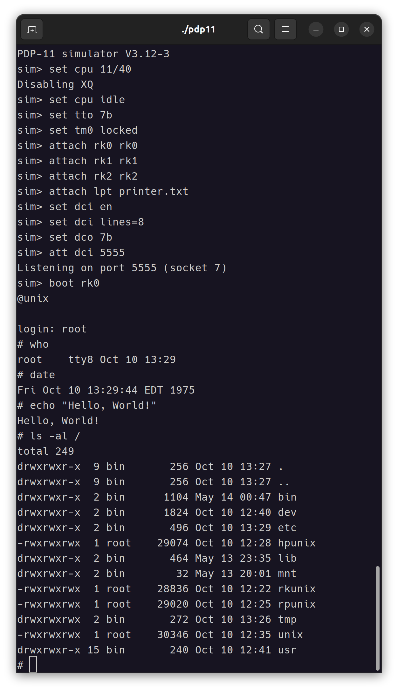

# Unix V6 Commentary

UNIX V6 주석

## UNIX V6 Source

- [Research Sixth Edition Unix](https://minnie.tuhs.org/cgi-bin/utree.pl?file=V6): 1975-05
- [dspinellis/unix-history-repo: Research V6](https://github.com/dspinellis/unix-history-repo/tree/Research-V6)

---

## Simulation

- [SimH](http://simh.trailing-edge.com/): History Simulator
  - [github](https://github.com/simh/simh)
  - [Win32-Development-Binaries](https://github.com/simh/Win32-Development-Binaries)
  - FAQ: [pdf](http://simh.trailing-edge.com/pdf/simh_faq.pdf)
- [Installing Unix v6 (PDP-11) on SIMH](https://gunkies.org/wiki/Installing_Unix_v6_(PDP-11)_on_SIMH)
- Unix v6 tape: [Unix-v6-Ken-Wellsch.tap](https://sourceforge.net/projects/bsd42/)
- /Archive/Distributions/[Research](https://www.tuhs.org/Archive/Distributions/Research/)

### Example

1. [Build SimH](docs/build.simh.md): PDP-11
2. [Install Unix v6](docs/install.unix.v6.md) on PDP-11
3. [Run Unix v6 on PDP-11](run.unix.v6.md)
4. [Games](docs/games.md): black jack, tic-tac-toe

---

## 참고 문서

- [The Unix Tree](https://minnie.tuhs.org/cgi-bin/utree.pl): Unix 여러 버전의 소스 코드와 매뉴얼을 볼 수 있다.
- [Unix V6 Manuals](http://man.cat-v.org/unix-6th/): Unix V6 매뉴얼
- [Commentary on the Sixth Edition UNIX Operating System](http://www.lemis.com/grog/Documentation/Lions/): 무료 Lions 책
- [UNIX V6로 배우는 커널의 원리와 구조: 고전으로 익히는 운영체제](http://www.hanbit.co.kr/store/books/look.php?p_code=B4221483331) / 아오야기 타카히로 / 한빛미디어 / 2014
- [Modern Operating Systems, 4th Edition](https://www.pearson.com/us/higher-education/program/Tanenbaum-Modern-Operating-Systems-4th-Edition/PGM80736.html) / Andrew S. Tanenbaum / Pearson / 2015 (1st: 1992)
- [Design of the UNIX Operating System](https://www.pearson.com/us/higher-education/program/Bach-Design-of-the-UNIX-Operating-System/PGM81513.html) / Maurice J. Bach / Prentice Hall / 1986
- [Computer Simulation and History](http://simh.trailing-edge.com): 옛날 프로세서 에뮬레이션 프로젝트
- [Lions' Commentary on UNIX 読書会(독서회)](https://sites.google.com/site/lionscommentaryonunixreading/home)
- Wikipedia: [PDP-11](https://en.wikipedia.org/wiki/PDP-11)
- [The UNIX Time-Sharing System - People @ EECS at UC Berkeley](https://people.eecs.berkeley.edu/~brewer/cs262/unix.pdf) / Dennis M. Ritchie and Ken Thompson: 초창기 UNIX 개요
- [UNIX Implementation](https://users.soe.ucsc.edu/~sbrandt/221/Papers/History/thompson-bstj78.pdf) / Ken Thompson: 초창기 UNIX 해설서
- [SETTING UP UNIX - Sixth Edition](https://minnie.tuhs.org/PUPS/Setup/v6_setup.html): 환경 구축, 부팅 방법
- [The Unix I/O System](http://www.tom-yam.or.jp/2238/ref/iosys.pdf) / Dennis M. Ritchie: 초창기 UNIX I/O 처리
- [PDP11-40 Processor Handbook](https://pdos.csail.mit.edu/6.828/2005/readings/pdp11-40.pdf): 프로세서 사양, 명령어 셋
- [PDP-11 Peripherals Handbook]: PDP 주변 디바이스 매뉴얼
- [C Reference Manual](https://www.bell-labs.com/usr/dmr/www/cman.pdf): C 언어 매뉴얼
- [UNIX Assembler Reference Manual](http://www.tom-yam.or.jp/2238/ref/as.pdf): 어셈블러 매뉴얼
