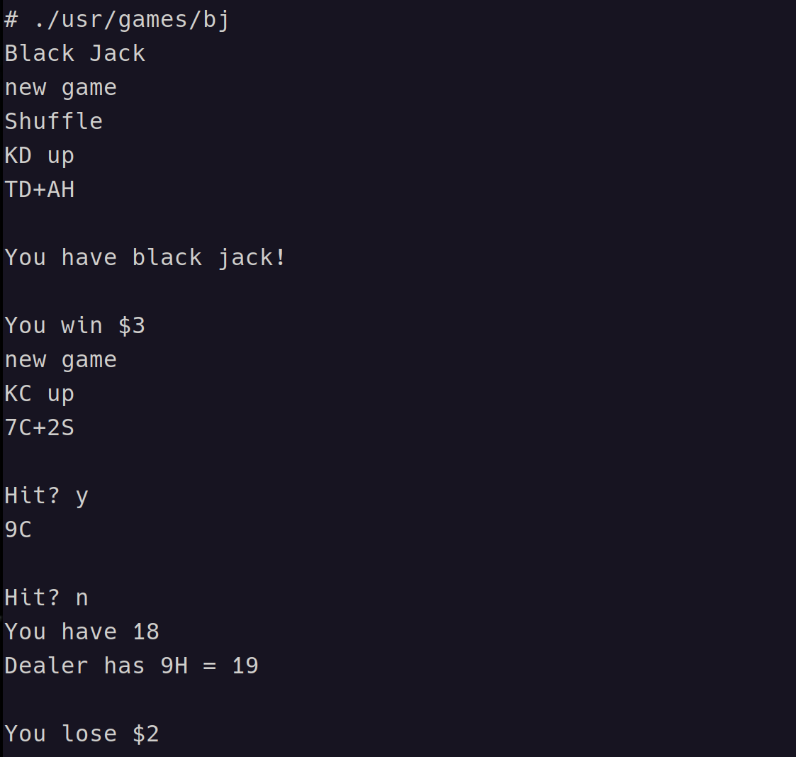
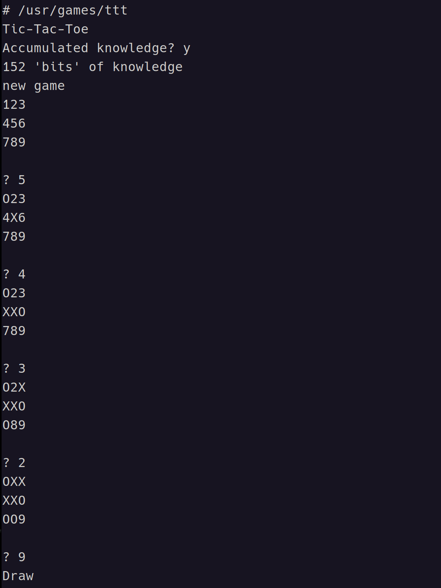

# /usr/games

```bash
# ls -al usr/games
total 64
drwxrwxr-x  2 bin       192 May 28 00:02 .
drwxrwxr-x 15 bin       240 Oct 10 12:41 ..
-rwxrwxr-x  1 bin      1562 May 13 20:24 bj
-rwxrwxr-x  1 bin     16088 May 13 20:24 chess
-rwxrwxr-x  1 bin      2468 May 13 20:24 cubic
-rwxrwxr-x  1 bin       624 May 13 20:24 moo
-rwxrwxr-x  1 bin      2192 May 13 20:24 ttt
-rw-rw-rw-  1 bin       304 May 28 00:00 ttt.k
-rwxrwxr-x  1 bin      5184 May 13 20:24 wump
```

## Black Jack



## Tic-Tac-Toe


