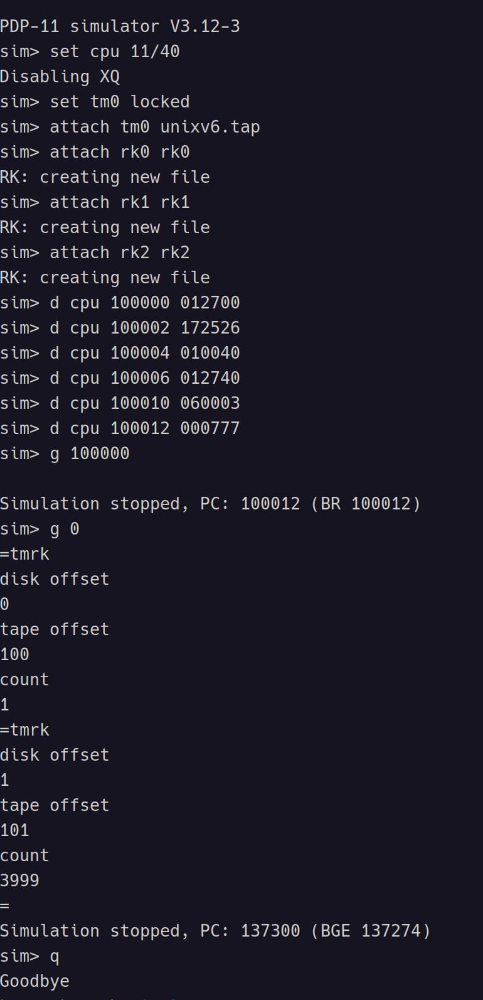
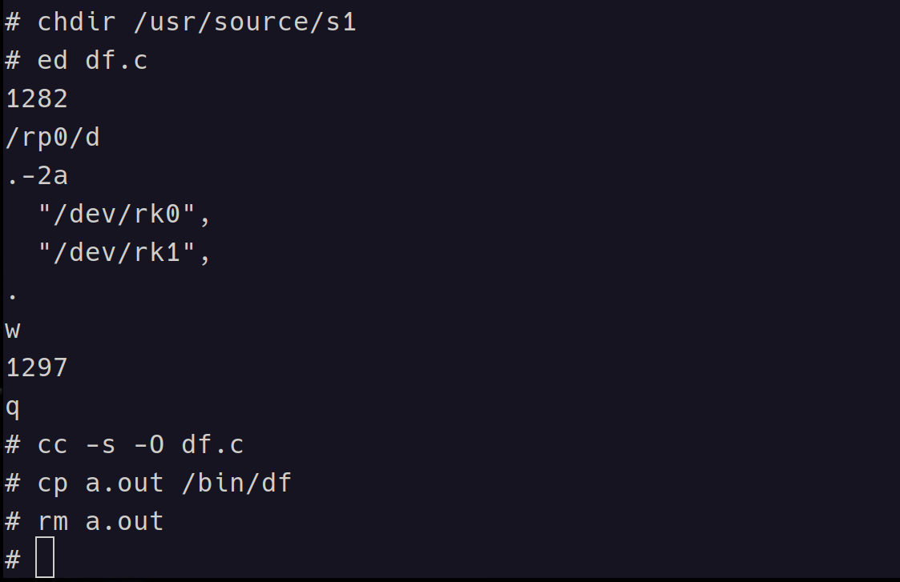
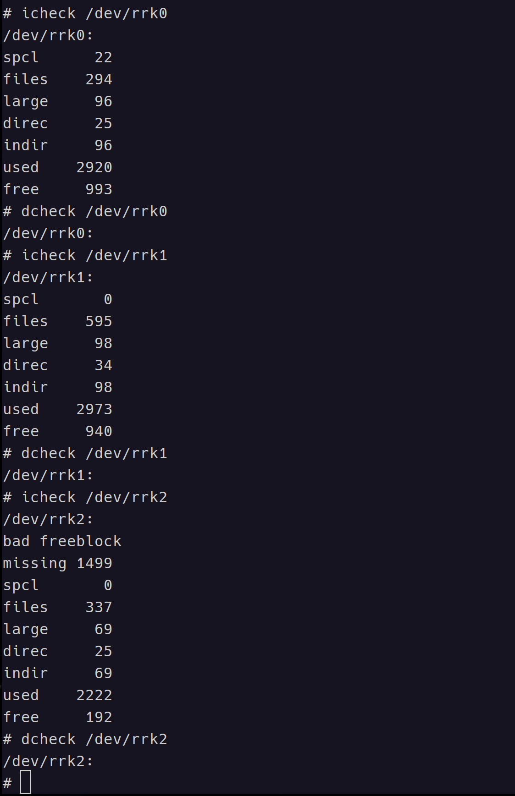
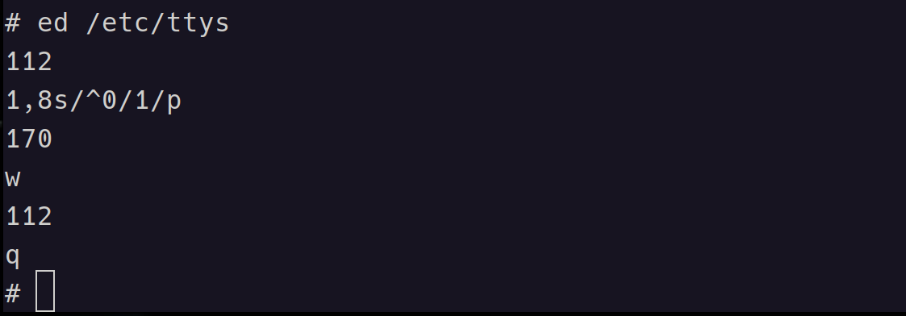
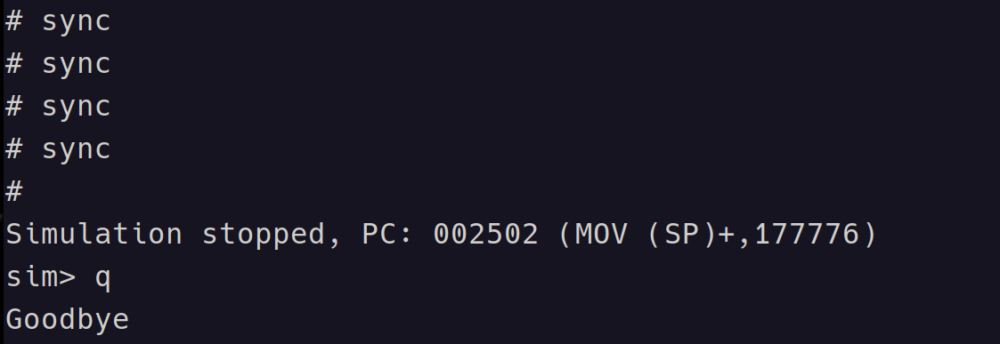

# Install Unix v6 on PDP-11

Computer History Wiki: [Installing Unix v6 (PDP-11) on SIMH](https://gunkies.org/wiki/Installing_Unix_v6_(PDP-11)_on_SIMH)

## Unix v6 tape

- a Unix v6 tape: [sourceforge.net](https://sourceforge.net/projects/bsd42/files/Install%20tapes/Research%20Unix/Unix-v6-Ken-Wellsch.tap.bz2/download)

Extract bz2:

```bash
bzip2 -d Unix-v6-Ken-Wellsch.tap.bz2
```

Move a tape file:

```bash
mv Unix-v6-Ken-Wellsch.tap labs/unixv6.tap
```

Ready:

```bash
tree -F -L 1 .

./
├── README.md
├── docs/
├── images/
├── labs/
│   ├── pdp11*
│   └── unixv6.tap
├── simh/
└── src/
```

---

## Install Unix v6

### Start PDP-11

```bash
cd labs
./pdp11
```

```bash
PDP-11 simulator V3.12-3
sim>
```

### Tape boot

Load bootblock and load up root partition onto the rk disk file:

```bash
set cpu 11/40
set tm0 locked
attach tm0 unixv6.tap
attach rk0 rk0
attach rk1 rk1
attach rk2 rk2
d cpu 100000 012700
d cpu 100002 172526
d cpu 100004 010040
d cpu 100006 012740
d cpu 100010 060003
d cpu 100012 000777
g 100000
```

Stop: `CTRL` + `E`

```bash
g 0
```

```bash
tmrk
0
100
1
tmrk
1
101
3999
```

Stop: `CTRL` + `E`

```bash
q
```

#### Results



```bash
tree -Fh labs

[4.0K]  labs/
├── [809K]  pdp11*
├── [2.0M]  rk0
├── [   0]  rk1
├── [   0]  rk2
└── [6.0M]  unixv6.tap
```

### Disk Install

#### Start PDP-11

```bash
./pdp11
```

```bash
PDP-11 simulator V3.12-3
sim>
```

#### Booting from hard disk

```bash
set cpu 11/40
set tto 7b
set tm0 locked
attach tm0 unixv6.tap
attach rk0 rk0
attach rk1 rk1
attach rk2 rk2
dep system sr 173030
boot rk0
```

output:

```bash
@
```

#### Bootloader

Load Unix kernel:

```bash
rkunix
```

output:

```bash
mem = 1035
RESTRICTED RIGHTS

Use, duplication or disclosure is subject to
restrictions stated in Contract with Western
Electric Company, Inc.
#
```

#### Fixing the Terminal

```bash
stty -lcase
```

output:

```txt
# STTY -LCASE
# 
```

#### Rebuilding the kernel

Build mkconf and run:

```bash
chdir /usr/sys/conf
cc mkconf.c
mv a.out mkconf
./mkconf
rk
tm
tc
8dc
lp
done
```

compile the config and link in the rest of kernel and copy it to the root:

```bash
as m40.s
mv a.out m40.o
cc -c c.c
as l.s
ld -x a.out m40.o c.o ../lib1 ../lib2
mv a.out /unix
```

#### The kernel

```bash
ls -l /unix
```

```bash
-rwxrwxrwx  1 root    30346 Oct 10 12:35 /unix
```


#### Building device files

```bash
/etc/mknod /dev/rk0 b 0 0
/etc/mknod /dev/rk1 b 0 1
/etc/mknod /dev/rk2 b 0 2
/etc/mknod /dev/mt0 b 3 0
/etc/mknod /dev/tap0 b 4 0
/etc/mknod /dev/rrk0 c 9 0
/etc/mknod /dev/rrk1 c 9 1
/etc/mknod /dev/rrk2 c 9 2
/etc/mknod /dev/rmt0 c 12 0
/etc/mknod /dev/lp0 c 2 0
/etc/mknod /dev/tty0 c 3 0
/etc/mknod /dev/tty1 c 3 1
/etc/mknod /dev/tty2 c 3 2
/etc/mknod /dev/tty3 c 3 3
/etc/mknod /dev/tty4 c 3 4
/etc/mknod /dev/tty5 c 3 5
/etc/mknod /dev/tty6 c 3 6
/etc/mknod /dev/tty7 c 3 7
chmod 640 /dev/*rk*
chmod 640 /dev/*mt*
chmod 640 /dev/*tap*
```

#### Restoring the rest of the OS

```bash
dd if=/dev/mt0 of=/dev/rk1 count=4000 skip=4100

4000+0 records in
4000+0 records out
```

```bash
/etc/mount /dev/rk1 /usr/source
```

```bash
dd if=/dev/mt0 of=/dev/rk2 count=4000 skip=8100

4000+0 records in
4000+0 records out
```

```bash
mkdir /usr/doc
```

#### Configure boot

```bash
cat >> /etc/rc
/etc/mount /dev/rk1 /usr/source
/etc/mount /dev/rk2 /usr/doc
```

Stop: `CTRL` + `D`

#### Rebuild the df command

```bash
chdir /usr/source/s1
```

```bash
ed df.c
/rp0/d
.-2a
  "/dev/rk0",
  "/dev/rk1",
.
w
q
```

```bash
cc -s -O df.c
cp a.out /bin/df
rm a.out
```



#### Check filesystems

```bash
icheck /dev/rrk0
dcheck /dev/rrk0
icheck /dev/rrk1
dcheck /dev/rrk1
icheck /dev/rrk2
dcheck /dev/rrk2
```



#### Enable multiser

```bash
ed /etc/ttys
1,8s/^0/1/p
w
q
```



#### Reboot

```bash
sync
sync
sync
sync
```

Stop: `CTRL` + `E`

```bash
q
```


